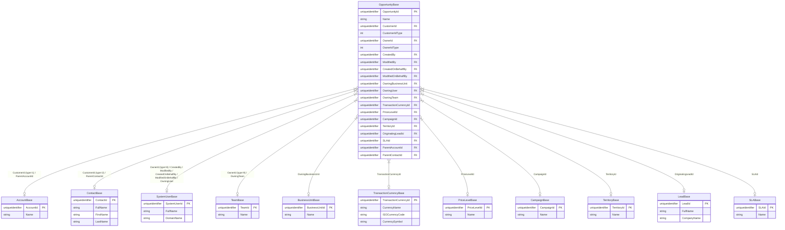

# Microsoft Dynamics CRM On-Premises: Opportunity Lookups SQL & ERD

This document provides T-SQL queries and an Entity Relationship Diagram (ERD) to retrieve all lookup values from the `OpportunityBase` table in Microsoft Dynamics CRM (On-Premises SQL Database).

---

## 1. Overview of Lookups in `OpportunityBase`

In Dynamics CRM / D365 On-Premises, `OpportunityBase` contains primary foreign key columns (GUIDs) pointing to related entity tables. Some lookups are **polymorphic** (e.g., `CustomerId` can refer to either an `Account` or a `Contact`; `OwnerId` can refer to a `SystemUser` or a `Team`).

### Summary of 16 Common Lookup Attributes:

| # | Lookup Attribute Name | Direct Foreign Key Column | Target Entity / Table | Target Primary Key | Display Name Column |
|---|----------------------|---------------------------|-----------------------|--------------------|---------------------|
| 1 | **Customer** (Polymorphic) | `CustomerId` | `AccountBase` or `ContactBase` | `AccountId` / `ContactId` | `Name` (Account) / `FullName` (Contact) |
| 2 | **Owner** (Polymorphic) | `OwnerId` | `SystemUserBase` or `TeamBase` | `SystemUserId` / `TeamId` | `FullName` (User) / `Name` (Team) |
| 3 | **Created By** | `CreatedBy` | `SystemUserBase` | `SystemUserId` | `FullName` |
| 4 | **Modified By** | `ModifiedBy` | `SystemUserBase` | `SystemUserId` | `FullName` |
| 5 | **Created By (Delegate)** | `CreatedOnBehalfBy` | `SystemUserBase` | `SystemUserId` | `FullName` |
| 6 | **Modified By (Delegate)** | `ModifiedOnBehalfBy` | `SystemUserBase` | `SystemUserId` | `FullName` |
| 7 | **Owning Business Unit** | `OwningBusinessUnit` | `BusinessUnitBase` | `BusinessUnitId` | `Name` |
| 8 | **Owning User** | `OwningUser` | `SystemUserBase` | `SystemUserId` | `FullName` |
| 9 | **Owning Team** | `OwningTeam` | `TeamBase` | `TeamId` | `Name` |
| 10 | **Currency** | `TransactionCurrencyId` | `TransactionCurrencyBase` | `TransactionCurrencyId` | `CurrencyName`, `ISOCurrencyCode` |
| 11 | **Price List** | `PriceLevelId` | `PriceLevelBase` | `PriceLevelId` | `Name` |
| 12 | **Source Campaign** | `CampaignId` | `CampaignBase` | `CampaignId` | `Name` |
| 13 | **Territory** | `TerritoryId` | `TerritoryBase` | `TerritoryId` | `Name` |
| 14 | **Originating Lead** | `OriginatingLeadId` | `LeadBase` | `LeadId` | `FullName`, `CompanyName` |
| 15 | **SLA** | `SLAId` | `SLABase` | `SLAId` | `Name` |
| 16 | **Parent Account / Contact** | `ParentAccountId` / `ParentContactId` | `AccountBase` / `ContactBase` | `AccountId` / `ContactId` | `Name` / `FullName` |

---

## 2. Entity Relationship Diagram (ERD)

The following Mermaid diagram shows `OpportunityBase` at the center and its relationships with all lookup entities:



---

## 3. T-SQL Queries

### Approach A: Direct SQL Query on Base Tables

Use this query when querying the database directly with administrative SQL access. It joins `OpportunityBase` (and `OpportunityExtensionBase` if present) to all lookup tables.

```sql
SELECT
    -- Opportunity Core Fields
    o.OpportunityId,
    o.Name AS OpportunityName,
    o.EstimatedValue,
    o.EstimatedCloseDate,
    o.StatusCode,
    o.StateCode,

    -- 1. Customer Lookup (Polymorphic: Account or Contact)
    o.CustomerId,
    o.CustomerIdType,
    CASE
        WHEN o.CustomerIdType = 1 THEN 'Account'
        WHEN o.CustomerIdType = 2 THEN 'Contact'
        ELSE NULL
    END AS CustomerType,
    COALESCE(cust_acc.Name, cust_con.FullName) AS CustomerName,

    -- 2. Owner Lookup (Polymorphic: User or Team)
    o.OwnerId,
    o.OwnerIdType,
    CASE
        WHEN o.OwnerIdType = 8 THEN 'SystemUser'
        WHEN o.OwnerIdType = 9 THEN 'Team'
        ELSE NULL
    END AS OwnerType,
    COALESCE(owner_usr.FullName, owner_team.Name) AS OwnerName,

    -- 3. Created By
    o.CreatedBy,
    cb_usr.FullName AS CreatedByName,

    -- 4. Modified By
    o.ModifiedBy,
    mb_usr.FullName AS ModifiedByName,

    -- 5. Created By (Delegate)
    o.CreatedOnBehalfBy,
    cob_usr.FullName AS CreatedOnBehalfByName,

    -- 6. Modified By (Delegate)
    o.ModifiedOnBehalfBy,
    mob_usr.FullName AS ModifiedOnBehalfByName,

    -- 7. Owning Business Unit
    o.OwningBusinessUnit,
    bu.Name AS OwningBusinessUnitName,

    -- 8. Owning User
    o.OwningUser,
    ou_usr.FullName AS OwningUserName,

    -- 9. Owning Team
    o.OwningTeam,
    ot_team.Name AS OwningTeamName,

    -- 10. Transaction Currency
    o.TransactionCurrencyId,
    curr.CurrencyName,
    curr.ISOCurrencyCode,
    curr.CurrencySymbol,

    -- 11. Price List
    o.PriceLevelId,
    pl.Name AS PriceListName,

    -- 12. Source Campaign
    o.CampaignId,
    camp.Name AS CampaignName,

    -- 13. Territory
    o.TerritoryId,
    ter.Name AS TerritoryName,

    -- 14. Originating Lead
    o.OriginatingLeadId,
    lead.FullName AS OriginatingLeadName,
    lead.CompanyName AS OriginatingLeadCompanyName,

    -- 15. SLA
    o.SLAId,
    sla.Name AS SLAName,

    -- 16. Parent Account & Parent Contact
    o.ParentAccountId,
    parent_acc.Name AS ParentAccountName,
    o.ParentContactId,
    parent_con.FullName AS ParentContactName

FROM dbo.OpportunityBase o WITH (NOLOCK)

-- Optional: Join Extension Base if custom attributes exist in your CRM version
-- LEFT JOIN dbo.OpportunityExtensionBase ext WITH (NOLOCK) ON o.OpportunityId = ext.OpportunityId

-- 1. Customer Joins
LEFT JOIN dbo.AccountBase cust_acc WITH (NOLOCK)
    ON o.CustomerId = cust_acc.AccountId AND o.CustomerIdType = 1
LEFT JOIN dbo.ContactBase cust_con WITH (NOLOCK)
    ON o.CustomerId = cust_con.ContactId AND o.CustomerIdType = 2

-- 2. Owner Joins
LEFT JOIN dbo.SystemUserBase owner_usr WITH (NOLOCK)
    ON o.OwnerId = owner_usr.SystemUserId AND o.OwnerIdType = 8
LEFT JOIN dbo.TeamBase owner_team WITH (NOLOCK)
    ON o.OwnerId = owner_team.TeamId AND o.OwnerIdType = 9

-- 3. CreatedBy
LEFT JOIN dbo.SystemUserBase cb_usr WITH (NOLOCK)
    ON o.CreatedBy = cb_usr.SystemUserId

-- 4. ModifiedBy
LEFT JOIN dbo.SystemUserBase mb_usr WITH (NOLOCK)
    ON o.ModifiedBy = mb_usr.SystemUserId

-- 5. CreatedOnBehalfBy
LEFT JOIN dbo.SystemUserBase cob_usr WITH (NOLOCK)
    ON o.CreatedOnBehalfBy = cob_usr.SystemUserId

-- 6. ModifiedOnBehalfBy
LEFT JOIN dbo.SystemUserBase mob_usr WITH (NOLOCK)
    ON o.ModifiedOnBehalfBy = mob_usr.SystemUserId

-- 7. OwningBusinessUnit
LEFT JOIN dbo.BusinessUnitBase bu WITH (NOLOCK)
    ON o.OwningBusinessUnit = bu.BusinessUnitId

-- 8. OwningUser
LEFT JOIN dbo.SystemUserBase ou_usr WITH (NOLOCK)
    ON o.OwningUser = ou_usr.SystemUserId

-- 9. OwningTeam
LEFT JOIN dbo.TeamBase ot_team WITH (NOLOCK)
    ON o.OwningTeam = ot_team.TeamId

-- 10. TransactionCurrency
LEFT JOIN dbo.TransactionCurrencyBase curr WITH (NOLOCK)
    ON o.TransactionCurrencyId = curr.TransactionCurrencyId

-- 11. PriceLevel
LEFT JOIN dbo.PriceLevelBase pl WITH (NOLOCK)
    ON o.PriceLevelId = pl.PriceLevelId

-- 12. Campaign
LEFT JOIN dbo.CampaignBase camp WITH (NOLOCK)
    ON o.CampaignId = camp.CampaignId

-- 13. Territory
LEFT JOIN dbo.TerritoryBase ter WITH (NOLOCK)
    ON o.TerritoryId = ter.TerritoryId

-- 14. OriginatingLead
LEFT JOIN dbo.LeadBase lead WITH (NOLOCK)
    ON o.OriginatingLeadId = lead.LeadId

-- 15. SLA
LEFT JOIN dbo.SLABase sla WITH (NOLOCK)
    ON o.SLAId = sla.SLAId

-- 16. Parent Account & Contact
LEFT JOIN dbo.AccountBase parent_acc WITH (NOLOCK)
    ON o.ParentAccountId = parent_acc.AccountId
LEFT JOIN dbo.ContactBase parent_con WITH (NOLOCK)
    ON o.ParentContactId = parent_con.ContactId;
```

---

### Approach B: Using CRM Filtered Views (`FilteredOpportunity`)

> **Best Practice for Reporting / SSRS:** Microsoft Dynamics CRM provides **Filtered Views** (e.g. `FilteredOpportunity`) that automatically enforce security roles and pre-join lookup display names (`...Name` suffix columns).

```sql
SELECT
    fo.opportunityid,
    fo.name AS OpportunityName,
    fo.estimatedvalue,
    fo.estimatedclosedate,
    fo.statuscodename AS StatusName,
    fo.statecodename AS StateName,

    -- Pre-joined Lookup Display Names in FilteredOpportunity:
    fo.customerid,
    fo.customeridname AS CustomerName,
    fo.customeridtype,
    fo.customeridtypename AS CustomerTypeName,

    fo.ownerid,
    fo.owneridname AS OwnerName,
    fo.owneridtype,
    fo.owneridtypename AS OwnerTypeName,

    fo.createdby,
    fo.createdbyname AS CreatedByName,

    fo.modifiedby,
    fo.modifiedbyname AS ModifiedByName,

    fo.createdonbehalfby,
    fo.createdonbehalfbyname AS CreatedOnBehalfByName,

    fo.modifiedonbehalfby,
    fo.modifiedonbehalfbyname AS ModifiedOnBehalfByName,

    fo.owningbusinessunit,
    fo.owningbusinessunitname AS OwningBusinessUnitName,

    fo.owninguser,
    fo.owningusername AS OwningUserName,

    fo.owningteam,
    fo.owningteamname AS OwningTeamName,

    fo.transactioncurrencyid,
    fo.transactioncurrencyidname AS CurrencyName,

    fo.pricelevelid,
    fo.pricelevelidname AS PriceListName,

    fo.campaignid,
    fo.campaignidname AS CampaignName,

    fo.territoryid,
    fo.territoryidname AS TerritoryName,

    fo.originatingleadid,
    fo.originatingleadidname AS OriginatingLeadName,

    fo.slaid,
    fo.slaidname AS SLAName,

    fo.parentaccountid,
    fo.parentaccountidname AS ParentAccountName,

    fo.parentcontactid,
    fo.parentcontactidname AS ParentContactName

FROM dbo.FilteredOpportunity fo;
```

---

## 4. Key Takeaways & Best Practices

1. **Polymorphic Lookups (`CustomerId`, `OwnerId`):**
   - Check `CustomerIdType` (`1` = Account, `2` = Contact) to determine which table contains the record.
   - Check `OwnerIdType` (`8` = SystemUser, `9` = Team) to determine ownership type.
2. **Filtered Views vs Base Tables:**
   - **Filtered Views (`FilteredOpportunity`)** are recommended for SSRS and external reports because they enforce CRM security roles and automatically include display names (`...name` suffix).
   - **Base Tables (`OpportunityBase`)** are useful for backend ETL, data migration, or administrative queries where full database access is available.
3. **`WITH (NOLOCK)`:**
   - Always include `WITH (NOLOCK)` when querying base tables directly on production CRM databases to avoid locking issues during active business hours.
